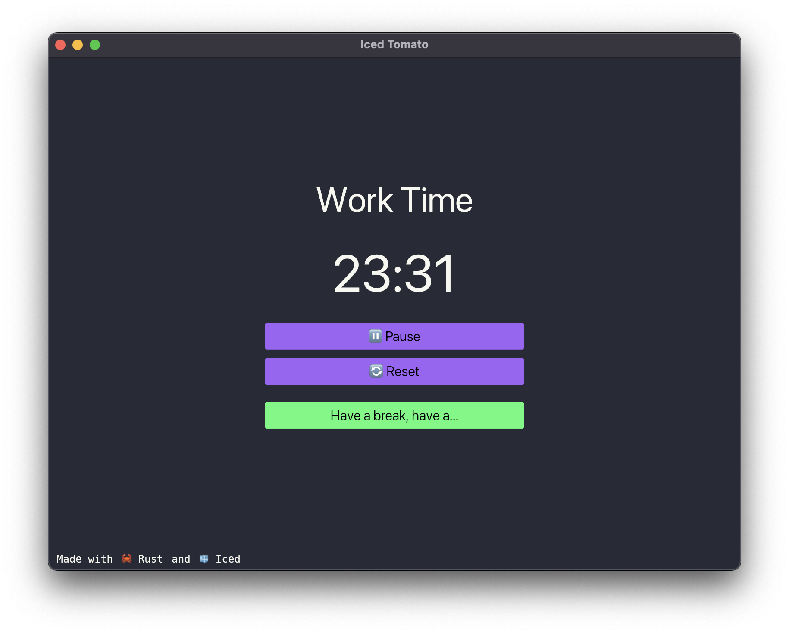

# 🧊 Iced Pomodoro

A minimal and efficient Pomodoro timer built with Rust and the Iced framework.




## 🎯 Features

- Clean and intuitive user interface built with Iced
- Minimal system resource usage
- Cross-platform compatibility (Windows, macOS, Linux)

## 🚀 Installation

Make sure you have Rust installed on your system. You can install it from [rust-lang.org](https://rust-lang.org).

```bash
# Clone the repository
git clone https://github.com/guihaume/iced_pomodoro
cd iced_pomodoro

# Build and run the application
cargo run --release
```

## 🛠️ Dependencies

- [iced](https://github.com/iced-rs/iced) - A cross-platform GUI framework

## 📖 Usage

1. Start the application
2. Set your desired mode work / break duration (25 / 5 minutes)
3. Click "Start" to begin your focused work session
4. The mode will auto switch after timer ends
5. Repeat and stay productive!

## 📝 License

This project is licensed under the MIT License - see the [LICENSE](LICENSE) file for details.

## 🙏 Acknowledgments

- The Iced framework developers for making GUI development in Rust a pleasure
- The Pomodoro Technique® by Francesco Cirillo

## 📞 Contact

If you have any questions or feedback, please open an issue in the repository.

---
Made with ❤️ using Rust and Iced
